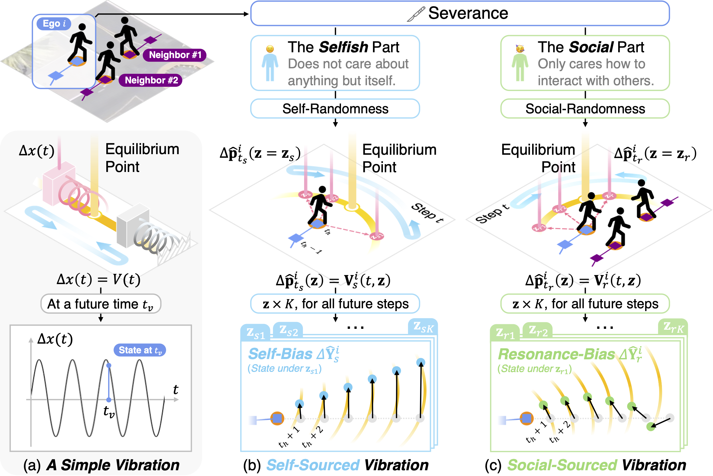

<!--
 * @Author: Ziqian Zou
 * @Date: 2024-05-31 15:53:21
 * @LastEditors: Conghao Wong
 * @LastEditTime: 2025-03-10 11:05:41
 * @Description: file content
 * @Github: https://github.com/LivepoolQ
 * Copyright 2024 Ziqian Zou, All Rights Reserved.
-->

## Information

This is the homepage of our paper "Resonance: Learning to Predict Social-Aware Pedestrian Trajectories as Co-Vibrations".
The paper is available on arXiv now.
Click the buttons below for more information.

<div style="text-align: center;">
    <a class="btn btn-colorful btn-lg" href="https://arxiv.org/abs/2412.02447">📖 Paper</a>
    <!-- <a class="btn btn-colorful btn-lg" href="https://github.com/cocoon2wong/SocialCirclePlus">📖 Supplemental Materials (TBA)</a>
    <br><br> -->
    <a class="btn btn-colorful btn-lg" href="https://github.com/cocoon2wong/Re">🛠️ Codes (PyTorch)</a>
    <a class="btn btn-colorful btn-lg" href="./guidelines">💡 Codes Guidelines</a>
    <br><br>
</div>

## Abstract

Learning to forecast trajectories of intelligent agents has caught much more attention recently.
However, it remains a challenge to accurately account for agents' intentions and social behaviors when forecasting, and in particular, to simulate the unique randomness within each of those components in an explainable and decoupled way.
Inspired by vibration systems and their resonance properties, we propose the *Resonance* (short for *Re*) model to encode and forecast pedestrian trajectories in the form of ``co-vibrations''.
It decomposes trajectory modifications and randomnesses into multiple vibration portions to simulate agents' reactions to each single cause, and forecasts trajectories as the superposition of these independent vibrations separately.
Also, benefiting from such vibrations and their spectral properties, representations of social interactions can be learned by emulating the resonance phenomena, further enhancing its explainability.
Experiments on multiple datasets have verified its usefulness both quantitatively and qualitatively.

## Highlights



- the ``vibration-like'' prediction strategy that simulates and decomposes the randomnesses in pedestrian trajectories as multiple vibrations according to different causes;
- the ``resonance-like'' representation of social interactions analogous to the resonance phenomena of vibrations.

## Citation

If you find this work useful, it would be grateful to cite our paper!

```bib
@article{wong2024resonance,
  title={Resonance: Learning to Predict Social-Aware Pedestrian Trajectories as Co-Vibrations},
  author={Wong, Conghao and Zou, Ziqian and Xia, Beihao and You, Xinge},
  journal={arXiv preprint arXiv:2412.02447},
  year={2024}
}
```

## Contact us

Conghao Wong ([@cocoon2wong](https://github.com/cocoon2wong)): conghaowong@icloud.com  
Ziqian Zou ([@LivepoolQ](https://github.com/LivepoolQ)): ziqianzoulive@icloud.com  
Beihao Xia ([@NorthOcean](https://github.com/NorthOcean)): xbh_hust@hust.edu.cn
